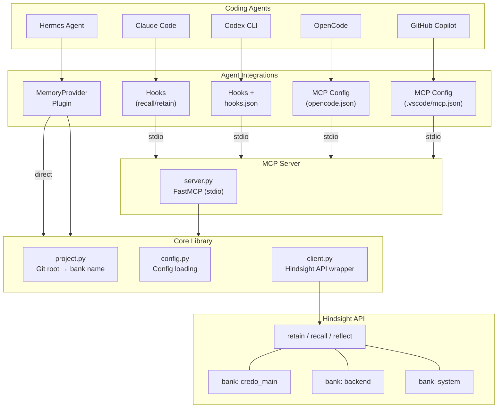
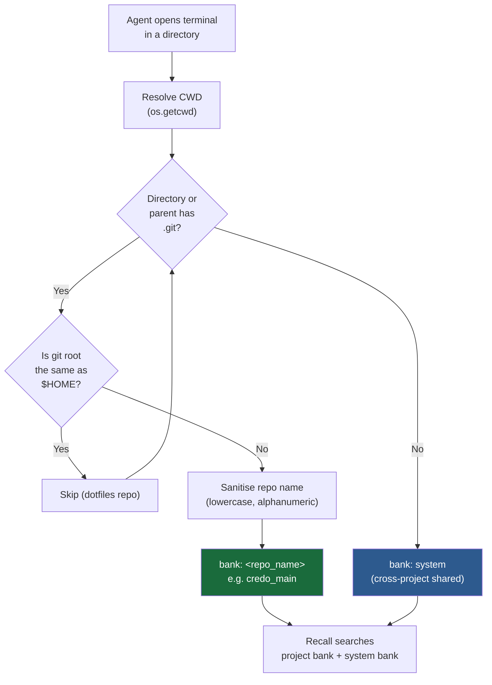
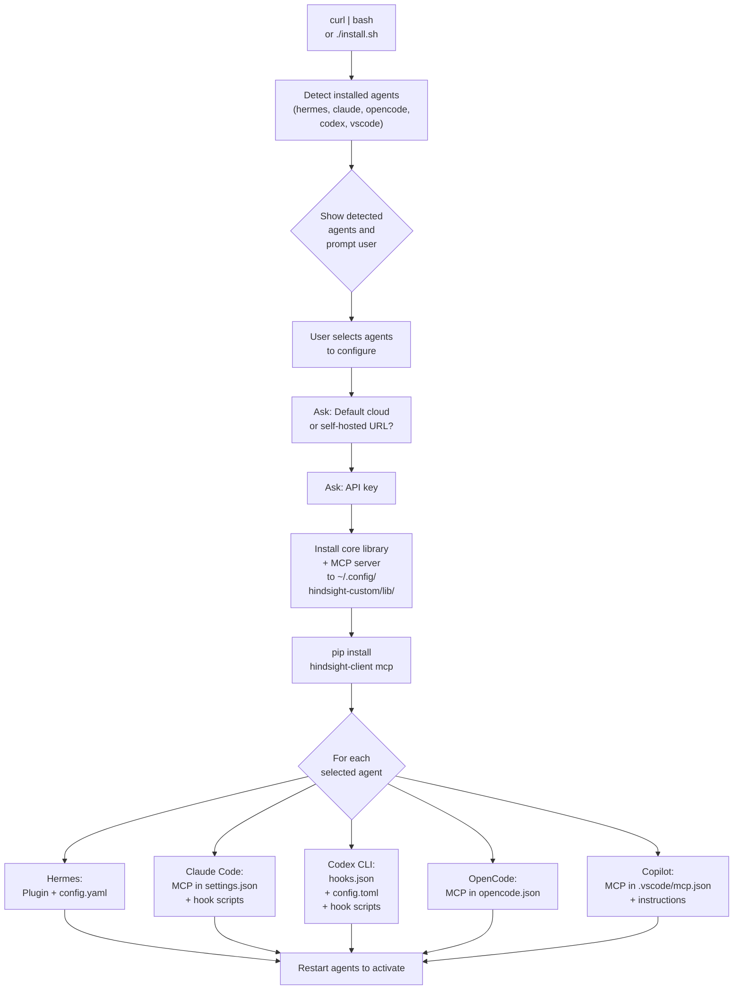
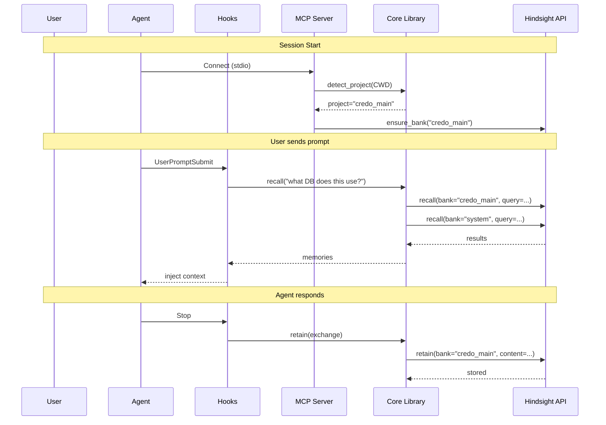

# Hindsight Custom — Project-Aware Memory for Any Agent

Agent-agnostic, project-aware memory routing for [Hindsight](https://vectorize.io/hindsight).
Automatically detects which git repository you're working in and routes memories to
project-specific banks. Works with any MCP-compatible coding agent.

## What it does

```
~/repos/credo_main/  →  bank: credo_main
~/repos/backend/     →  bank: backend
~/repos/frontend/    →  bank: frontend
~  or  /tmp          →  bank: system
```

Every recall searches **both** the project bank and the shared `system` bank,
so cross-project knowledge is always available.

## Supported Agents

| Agent | Integration | Auto-recall | Auto-retain |
|-------|------------|:-----------:|:-----------:|
| **Hermes Agent** | MemoryProvider plugin | ✅ prefetch | ✅ every N turns |
| **Claude Code** | MCP + hooks | ✅ hook | ✅ hook |
| **Codex CLI** | MCP + hooks | ✅ hook | ✅ hook |
| **OpenCode** | MCP server | via tools | via tools |
| **GitHub Copilot** | MCP + instructions | via tools | via tools |

## Architecture



## Project Detection Flow



## Installation Flow



## Memory Flow (Per Agent)



## Quick Install

```bash
curl -fsSL https://raw.githubusercontent.com/jwvolschenk/hindsight-custom/main/install.sh | bash
```

On an interactive terminal the installer opens **Hindsight Control**, a Textual
management UI for configuring API settings, installing agent integrations,
updating the shared MCP server, and selectively uninstalling integrations.

Force the legacy shell installer:

```bash
curl -fsSL https://raw.githubusercontent.com/jwvolschenk/hindsight-custom/main/install.sh | bash -s -- --legacy
```

Install specific agents only:

```bash
./install.sh install --agents claude-code,codex
```

Non-interactive (all agents, no prompts):

```bash
./install.sh install --all --yes
```

Build a standalone TUI binary:

```bash
./scripts/build-installer-binary.sh
```

## Configuration

Config file: `~/.config/hindsight-custom/config.json`

```json
{
  "api_url": "https://api.hindsight.vectorize.io",
  "apiKey": "your-api-key",
  "timeout": 300,
  "budget": "mid",
  "search_shared": true,
  "auto_retain": true,
  "retain_every_n_turns": 3,
  "recall_max_input_chars": 800
}
```

Or set environment variables: `HINDSIGHT_API_KEY`, `HINDSIGHT_API_URL`.

### Key Settings

| Setting | Default | Description |
|---------|---------|-------------|
| `search_shared` | `true` | Also search `system` bank on recall |
| `retain_every_n_turns` | `3` | Auto-retain frequency (1 = every turn) |
| `budget` | `"mid"` | Recall budget: `low`, `mid`, `high` |
| `recall_max_input_chars` | `800` | Truncate queries to this length |

## MCP Server

The MCP server is the heart of the integration. All agents connect to it via
stdio transport. It exposes five tools:

| Tool | Description |
|------|-------------|
| `hindsight_retain` | Store a memory (auto-routes to project bank) |
| `hindsight_recall` | Search memories (project + system banks) |
| `hindsight_reflect` | Reason across all memories for a coherent answer |
| `hindsight_project` | Show or override the active project |
| `hindsight_banks` | List, create, delete, or inspect banks |

Run directly for testing:

```bash
python3 -m mcp_server
```

## Project Structure

```
hindsight-custom/
├── core/                    Shared Python library
│   ├── project.py           Git root → bank name detection
│   ├── config.py            Config loading (file + env vars)
│   └── client.py            Hindsight API wrapper with bank routing
│
├── mcp_server/              MCP server (stdio transport)
│   ├── server.py            FastMCP server with 5 tools
│   ├── __main__.py          python -m mcp_server
│   └── config.example.json  Config template
│
├── integrations/            Agent-specific code
│   ├── hermes/              MemoryProvider plugin (direct core usage)
│   ├── claude-code/         Hooks (recall.sh, retain.sh) + README
│   ├── codex/               Hooks + hooks.json + README
│   ├── opencode/            MCP config + README
│   └── copilot/             MCP config + instructions + README
│
├── install.sh               Interactive unified installer
├── pyproject.toml           Python package definition
├── AGENTS.md                Agent development guide
└── README.md                This file
```

## Uninstall

```bash
./install.sh --uninstall
```

## Development

```bash
# Clone
git clone git@github.com:jwvolschenk/hindsight-custom.git
cd hindsight-custom

# Install deps
pip install hindsight-client mcp

# Test core library
python3 -c "from core.project import detect_project; print(detect_project())"

# Test MCP server starts
python3 -m mcp_server

# Run the installer
./install.sh --all
```

## How Agents Connect

| Agent | Transport | Auto-hooks | Config File |
|-------|-----------|------------|-------------|
| **Hermes** | Direct (Python) | sync_turn, prefetch | `~/.hermes/config.yaml` |
| **Claude Code** | stdio MCP | UserPromptSubmit, Stop | `~/.claude/settings.json` |
| **Codex CLI** | stdio MCP | UserPromptSubmit, Stop | `~/.codex/config.toml` + `hooks.json` |
| **OpenCode** | stdio MCP | via tools | `opencode.json` |
| **Copilot** | stdio MCP | via instructions | `.vscode/mcp.json` |

## License

MIT
